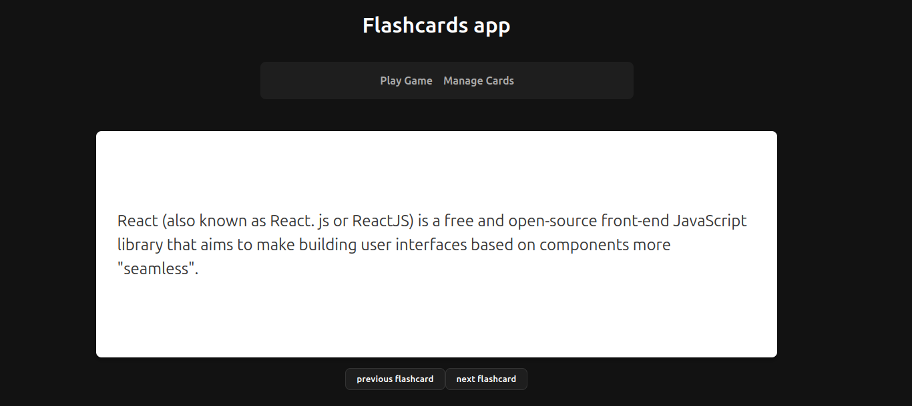
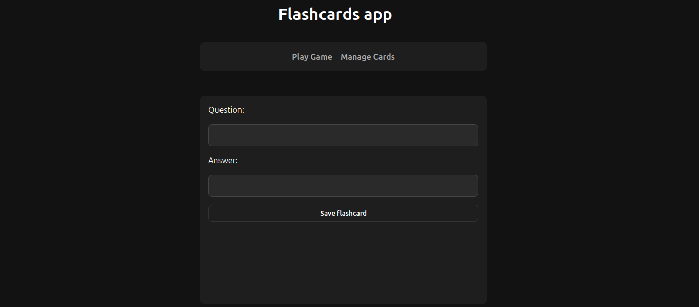

# Flashcard Application

## Description
This project is a simple flashcard application created as a personal project for learning purposes, [try the app now!](https://free-flashcards.netlify.app/)

## Appearance





## Technologies Used


## Features
* **Interactive Flip Cards:** Click any card to instantly toggle between the question and the answer.
* **Deck Navigation:** Seamlessly cycle through the flashcard deck using "Next" and "Previous" controls.
* **Responsive Design:** Optimized for a clean viewing experience.


## How to Run the Application

In the project directory, follow these steps to get started:

### 1. Install Dependencies
Run the following command to install the necessary packages:

``` bash
npm install
npm run dev
```

#### Open http://localhost:5173 to view it in your browser.